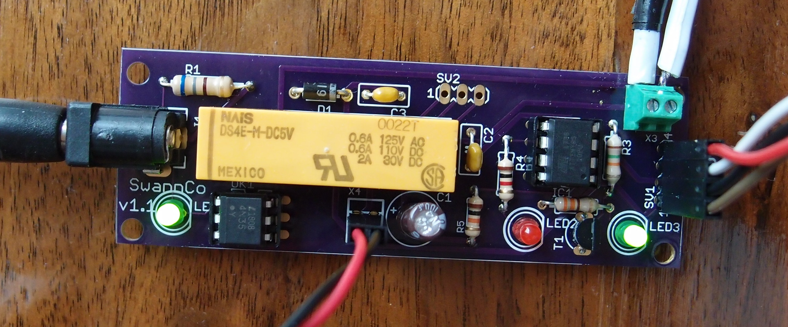

# AutoStart
The system which restarts a Raspberry Pi after it has been shutdown due to lightning.

### AutoStart.ino
A program which runs on an ATTiny45 to electrically "push" the start button on a UPS3v2 board to power up the system. The tiny is turned on by the relay which disconnects the 12v wall wart from the UPS.

### schematic.pdf and board.pdf
Show a potential commercially made board, by Oshpark for example.

### PCB-topview.png
Shows a OSH Park rendering of the pcb top view.

### PCB-bottomview.png
Shows a OSH Park rendering of the pcb bottom view.

### proto-board.jpg
Shows a picture of the prototype disconnector/autostart board.

I've built and installed 3 of these on my network.

As of 22 Feb 2021, I built one of the Oshpark boards and implented it.  Works like a champ
Here is a picture:

